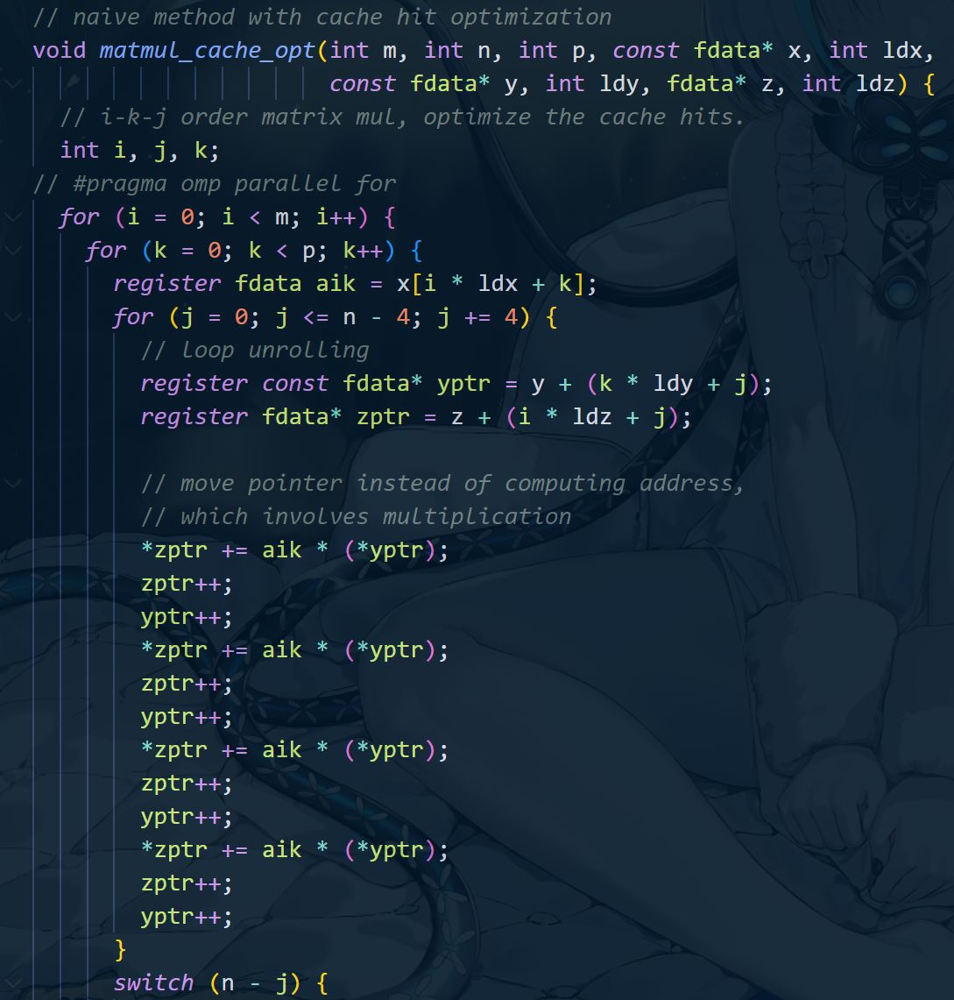

# CS205 C/ C++ Programming - Project 4: Matrix multiplication race

**Name:** Lv Yue  
**SID:** 11710420

***This project is hosted at <https://github.com/JustLittleFive/Matrix_Multiplication_Race>***  

## Part1: Analysis  

**Project goal**:  Implement matrix multiplication in C and try HARD to improve its speed, then compare with OpenBlas or else.  

## Part2: Core code

The ```header.h``` include all required *C standard library header files*, declare everything need by benchmark.

The ```source2.c``` provides the time and correctness benchmark of ```OpenBlas``` and the different implemented functions in ```source1.c```.  

The ```source1.c``` implement 5 different method for matrix multiply:  

1. The ```matmul_native``` function is the most native way to do matrix mutiply...?  

  

No! It is already optimized by allocate fdata with alignment.  

  

However, it is still using looping-looping-loop in calculate order, as the baseline of this project.  
  
---------------------------

2. The ```matmul_native_with_omp``` function is one way to improve ```matmul_native```,  
by using OpenMP to parallzlize the ```for``` loop.
However we won't use it again due to its unstable output, which can magnify the loss of precision.  

---------------------------

3. The ```matmul_cache_opt``` function is optimizing cache hit rate by reversing loop order.



The memory access discontinuity is one of the main reasons of high time cost of matrix multiplication.  
Assume the ```n``` dimentions matrix store in one dimention array and store by row, then calculate one element in normal way will jump ```1``` time in one matrix and ```n``` times in another matrix in memory. Which means if calculate in ```i-j-k``` order will jump ```n^3+n^2-n``` times, but if calculate in ```i-k-j``` order will only cost ```n^2``` jumps.  
This is how to optimize cache hit rate by reversing loop order.  

---------------------------

4. The ```matmul_dc_opt``` function is based on ```matmul_cache_opt``` function adding divide-and-conquer optimization.
The goal of divide is matrix size reach ```64^2``` of smaller.  

---------------------------

5. The ```matmul_strassen``` function is strassen algorithm combine with ```matmul_cache_opt```.  

  

The core idea of strassen algorithm is ```2^2 matrix multiplication needed multiplication times can be reduced from 8 to 7```. Use this idea on the primary matrix ***recursively*** is the basic idea of this algorithm.

## Part 3: Result & Verification

Test 16*16 matrix multiplication:  
  

Test 128x128 matrix multiplication:  
  

Test 1k*1k matrix multiplication:  
  

Test 8k*8k matrix multiplication (the full result is still running, could check on github later):  
  

64k*64k test cause core dump, because running out of memory.

## Part 4 - Difficulties & Solutions

1. ```gettimeofday()``` and ```clock()``` return different timing result.  
*My choice is to keep both: after the optimization method is the result of ```gettimeofday()``` timing, and after running time is the result of the above optimization method timing by ```clock()```.*
2. Out of memory.  
 *It cannot be solved, the computer memory and hard disk are neither not enough to run the matrix multiplication of 64k\*64k size.*
